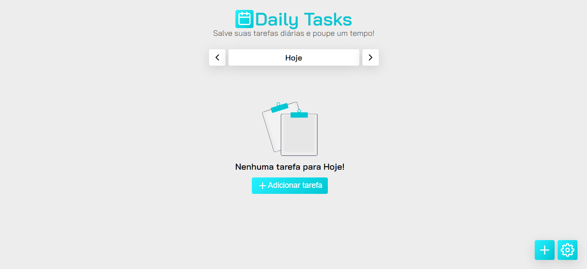

 

  

  <h2 align="center">Daily Tasks</h3>

  

    <a href="https://github.com/miguel5g/daily-tasks/issues">Report Bug</a>
    ·
    <a href="https://github.com/miguel5g/daily-tasks/issues">Request Feature</a>
  

<!-- TABLE OF CONTENTS -->

  
Table of Contents

  <ol>
    <li>
      <a href="#about-the-project">About The Project</a>
      <ul>
        <li><a href="#built-with">Built With</a></li>
      </ul>
    </li>
    <li><a href="#contributing">Contributing</a></li>
    <li><a href="#license">License</a></li>
    <li><a href="#contact">Contact</a></li>
  </ol>

## About The Project

  

Thinking...

### Built With

The entire project is being developed with:
* Javascript
* HTML
* CSS

## Contributing

Any help is welcome! Feel like willing to contribute.

1. Fork the Project
2. Create your Feature Branch (`git checkout -b feature/AmazingFeature`)
3. Commit your Changes (`git commit -m 'Add some AmazingFeature'`)
4. Push to the Branch (`git push origin feature/AmazingFeature`)
5. Open a Pull Request

## License

Distributed under the MIT License. See `LICENSE` for more information.

## Contact

Miguel Ângelo - [@guel5g](https://twitter.com/guel5g) - miguelcg958@gmail.com
